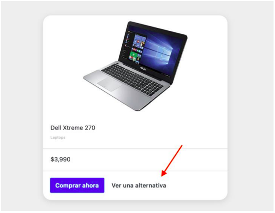

# CASICOMPRO

EJERCICIO:
Una nueva startup, llamada CasiCompro, está desarrollando una plataforma de compra y venta de
productos en línea. El objetivo de esta empresa es ayudar a compradores indecisos a comparar productos,
que satisfacen las necesidades que buscas. Te han contratado para que, con tus conocimientos de objetos
en JavaScript, generes un módulo que exponga dos alternativas para comprar. 

